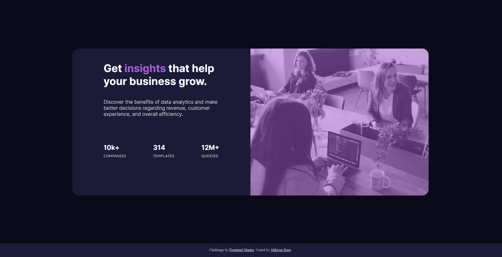

# Frontend Mentor - Stats preview card component solution

This is a solution to the [Stats preview card component challenge on Frontend Mentor](https://www.frontendmentor.io/challenges/stats-preview-card-component-8JqbgoU62).


### Screenshot




### Links

- Solution URL: [GitHub](https://github.com/basuabhirup/stats-preview-card)
- Live Site URL: [Vercel](https://stats-preview-card-basuabhirup.vercel.app/)

## My process

### Built with

- HTML5 markup
- CSS custom properties
- Flexbox
- CSS Grid


### What I learned

The main thing that I have learned doing this project is the concept of css flexbox. I thouroughly went through the documentation, learned the concept of flexible box layout and applied it in implementing this project. The main catch was when I changed the display property of the card as inline-flex.


```css
.card {
  display: inline-flex;
  flex-direction: row-reverse;
  flex-wrap: wrap;
  justify-content: center;
  margin: 7.5% auto;
  padding: 0;
}
```
Another interesting thing was to optimise the website for mobile viewing. I have made two different css files for this purpose placing the threshold screen width to be 1100px.

```html
<link rel="stylesheet" media="screen and (min-width: 1101px)" href="styles.css" type="text/css"  />
 <link rel='stylesheet' media='screen and (max-width: 1100px)' href='mstyles.css' type='text/css' />
```

Finally I adjusted the width of the text contents and changed the text alignment into center for proper mobile optimisation.

### Useful resources

- [W3 Schools](https://www.w3schools.com/cssref/default.asp) 
- [Mozilla Developer Network](https://developer.mozilla.org/en-US/docs/Learn) 
- [DevDocs](https://devdocs.io/css/)


## Author

### __Abhirup Basu__

- GitHub - [@basuabhirup](https://github.com/basuabhirup)
- LinkedIn - [@basu-abhirup](https://www.linkedin.com/in/basu-abhirup/)
- Frontend Mentor - [@basuabhirup](https://www.frontendmentor.io/profile/basuabhirup)
- Twitter - [@basu_abhirup27](https://www.twitter.com/basu_abhirup27)

